content = """
# Authentication & Identity – Sequence Diagram

This diagram covers **regular login with MFA**, **password reset**, and **social-login (OAuth) adapters** for the ride-hailing platform.

```mermaid
sequenceDiagram
    autonumber

    %% ===== Participants =====
    participant App  as 📱 Mobile / Web App
    participant Auth as 🔐 Auth Service
    participant MFA  as 🔑 MFA Service (TOTP / SMS)
    participant IdP  as 🌐 Social IdP (Google / Apple)
    participant Mail as ✉️ Email Service

    %% ================================================================
    %% 1. Standard Login with Optional MFA
    %% ================================================================
    App->>Auth: POST /login (email, pwd)
    Auth->>Auth: Verify credentials (hash compare)
    alt MFA enabled
        Auth-->>App: 202 Need MFA (factorId)
        App->>MFA: POST /verify (factorId, code)
        MFA-->>Auth: MFA OK
    else MFA not enabled
        note over Auth: Skip MFA
    end
    Auth->>Auth: Generate JWT + Refresh
    Auth-->>App: 200 OK {access, refresh}

    %% ================================================================
    %% 2. Password Reset (Forgot Password)
    %% ================================================================
    App-->>Auth: POST /forgot-password (email)
    Auth->>Mail: sendResetLink(email, token)
    Mail-->>App: "Check your inbox"
    App->>Auth: GET /reset-password?token=abc
    Auth->>Auth: Validate token & expiry
    Auth-->>App: 200 Form (new pwd)
    App->>Auth: POST /reset-password (new pwd, token)
    Auth->>Auth: Update hashed pwd
    Auth-->>App: 200 Password Updated

    %% ================================================================
    %% 3. Social Login (OAuth 2.0 Flow)
    %% ================================================================
    App->>IdP: GET /auth?client_id=... (redirect)
    IdP-->>App: AuthCode (302 redirect back)
    App->>Auth: POST /oauth/callback (code)
    Auth->>IdP: POST /token (code)
    IdP-->>Auth: id_token + profile
    alt First-time social user
        Auth->>Auth: createUser(profile)
    else Returning social user
        note over Auth: Load user by socialId
    end
    Auth->>Auth: Generate JWT
    Auth-->>App: 200 OK {access, refresh}
```

