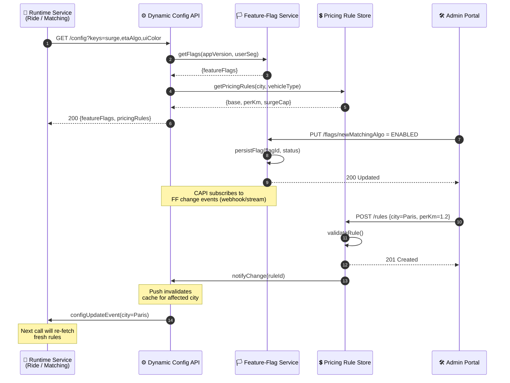

# Configuration & Pricing Management – Sequence Diagram

Depicts how the **Dynamic Config API**, **Feature‑Flag Service**, and **Pricing Rule Store** interact for both **runtime reads** and **admin updates**.

---

### Component Responsibilities

| Component | Responsibility |
|-----------|----------------|
| **Feature‑Flag Service** | Per‑environment flag toggles, segment targeting, real‑time push events |
| **Pricing Rule Store** | CRUD on base/per‑km/per‑minute + surge caps; versioned rules per city |
| **Dynamic Config API** | Aggregates flags + pricing + misc configs; caches with short TTL; streams invalidation messages |

Extend with flag prerequisites, percentage roll‑outs, or multi‑currency rules as needed.
