# Configuration & Pricing Management – Sequence Diagram

Depicts how the **Dynamic Config API**, **Feature‑Flag Service**, and **Pricing Rule Store** interact for both **runtime reads** and **admin updates**.

```mermaid
sequenceDiagram
    autonumber

    %% ===== Participants =====
    participant App   as 🚕 Runtime Service<br/>(Ride / Matching)
    participant CAPI  as ⚙️ Dynamic Config API
    participant FF    as 🏳️ Feature‑Flag Service
    participant Price as 💲 Pricing Rule Store
    participant Admin as 🛠️ Admin Portal

    %% ------------------------------------------------------------
    %% 1. Runtime – Fetch Config & Flags (Startup or TTL refresh)
    %% ------------------------------------------------------------
    App->>CAPI: GET /config?keys=surge,etaAlgo,uiColor
    CAPI->>FF: getFlags(appVersion, userSeg)
    FF-->>CAPI: {featureFlags}
    CAPI->>Price: getPricingRules(city, vehicleType)
    Price-->>CAPI: {base, perKm, surgeCap}
    CAPI-->>App: 200 {featureFlags, pricingRules}

    %% ------------------------------------------------------------
    %% 2. Admin – Toggle Feature Flag
    %% ------------------------------------------------------------
    Admin->>FF: PUT /flags/newMatchingAlgo = ENABLED
    FF->>FF: persistFlag(flagId, status)
    FF-->>Admin: 200 Updated
    Note over FF, CAPI: CAPI subscribes to<br/>FF change events (webhook/stream)

    %% ------------------------------------------------------------
    %% 3. Admin – Update Pricing Rule
    %% ------------------------------------------------------------
    Admin->>Price: POST /rules {city=Paris, perKm=1.2}
    Price->>Price: validateRule()
    Price-->>Admin: 201 Created
    Price->>CAPI: notifyChange(ruleId)
    Note over CAPI: Push invalidates<br/>cache for affected city

    %% ------------------------------------------------------------
    %% 4. Cache Invalidation (Async)
    %% ------------------------------------------------------------
    CAPI->>App: configUpdateEvent(city=Paris)
    Note over App: Next call will re‑fetch<br/>fresh rules
```

---

### Component Responsibilities

| Component | Responsibility |
|-----------|----------------|
| **Feature‑Flag Service** | Per‑environment flag toggles, segment targeting, real‑time push events |
| **Pricing Rule Store** | CRUD on base/per‑km/per‑minute + surge caps; versioned rules per city |
| **Dynamic Config API** | Aggregates flags + pricing + misc configs; caches with short TTL; streams invalidation messages |

Extend with flag prerequisites, percentage roll‑outs, or multi‑currency rules as needed.
