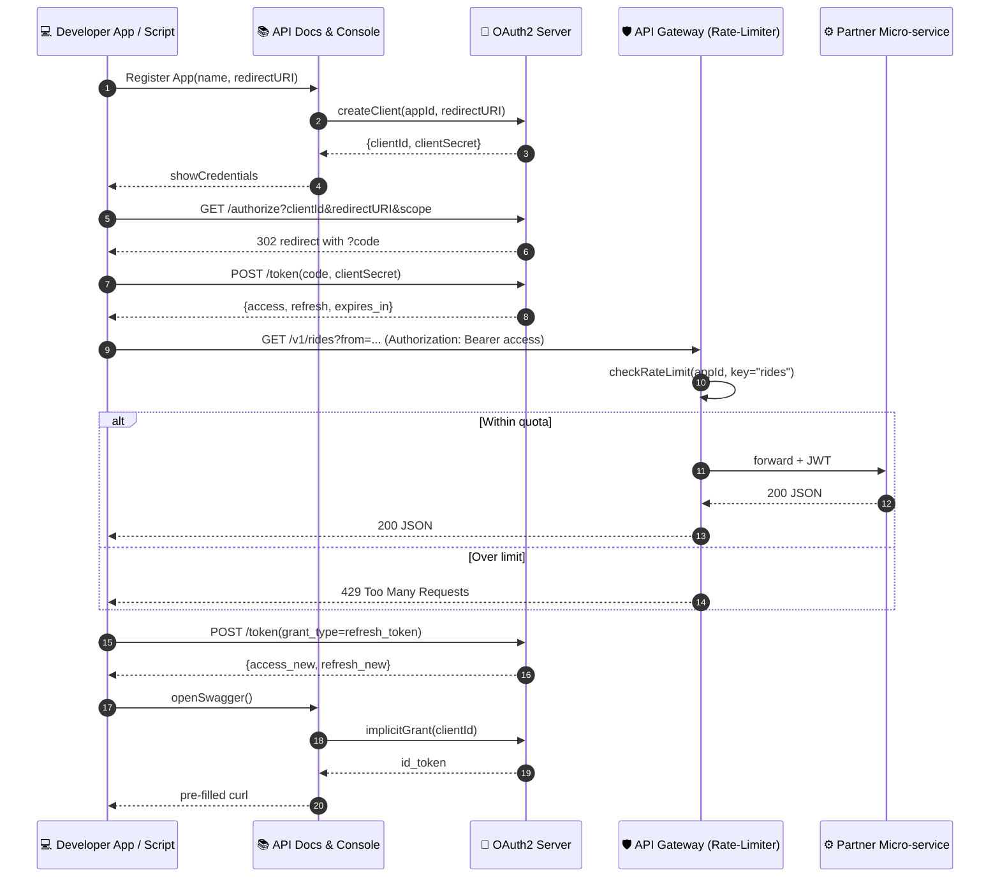

# Developer / Partner API – Sequence Diagram

Covers **OAuth2 Server**, **Rate‑Limiter / API Gateway**, and **API Documentation Portal** interactions for third‑party developers.

---

### Component Responsibilities

| Component | Role |
|-----------|------|
| **API Documentation Portal** | Hosts OpenAPI/Swagger, client registration, interactive console |
| **OAuth2 Server** | Issues tokens (Auth Code + PKCE), validates introspection, rotates secrets |
| **API Gateway (Rate‑Limiter)** | Enforces per‑client quotas, injects internal JWT, routes to micro‑services |
| **Partner Micro‑service** | Business logic exposed to partners |
