# Developer / Partner API – Sequence Diagram

Covers **OAuth2 Server**, **Rate‑Limiter / API Gateway**, and **API Documentation Portal** interactions for third‑party developers.

```mermaid
sequenceDiagram
    autonumber

    %% ===== Participants =====
    participant Dev   as 💻 Developer App / Script
    participant Portal as 📚 API Docs & Console
    participant OAuth as 🔐 OAuth2 Server
    participant GW    as 🛡️ API Gateway (Rate‑Limiter)
    participant Svc   as ⚙️ Partner Micro‑service

    %% ------------------------------------------------------------
    %% 0. Client Registration via Portal
    %% ------------------------------------------------------------
    Dev->>Portal: Register App(name, redirectURI)
    Portal->>OAuth: createClient(appId, redirectURI)
    OAuth-->>Portal: {clientId, clientSecret}
    Portal-->>Dev: showCredentials

    %% ------------------------------------------------------------
    %% 1. OAuth 2.0 Authorization Code Flow
    %% ------------------------------------------------------------
    Dev->>OAuth: GET /authorize?clientId&redirectURI&scope
    OAuth-->>Dev: 302 redirect with ?code
    Dev->>OAuth: POST /token(code, clientSecret)
    OAuth-->>Dev: {access, refresh, expires_in}

    %% ------------------------------------------------------------
    %% 2. API Call through Gateway (Rate‑Limited)
    %% ------------------------------------------------------------
    Dev->>GW: GET /v1/rides?from=... (Authorization: Bearer access)
    GW->>GW: checkRateLimit(appId, key="rides")
    alt Within quota
        GW->>Svc: forward + JWT
        Svc-->>GW: 200 JSON
        GW-->>Dev: 200 JSON
    else Over limit
        GW-->>Dev: 429 Too Many Requests
    end

    %% ------------------------------------------------------------
    %% 3. Token Refresh
    %% ------------------------------------------------------------
    Dev->>OAuth: POST /token(grant_type=refresh_token)
    OAuth-->>Dev: {access_new, refresh_new}

    %% ------------------------------------------------------------
    %% 4. Interactive Docs "Try it" (OpenAPI Console)
    %% ------------------------------------------------------------
    Dev->>Portal: openSwagger()
    Portal->>OAuth: implicitGrant(clientId)
    OAuth-->>Portal: id_token
    Portal-->>Dev: pre‑filled curl
```

---

### Component Responsibilities

| Component | Role |
|-----------|------|
| **API Documentation Portal** | Hosts OpenAPI/Swagger, client registration, interactive console |
| **OAuth2 Server** | Issues tokens (Auth Code + PKCE), validates introspection, rotates secrets |
| **API Gateway (Rate‑Limiter)** | Enforces per‑client quotas, injects internal JWT, routes to micro‑services |
| **Partner Micro‑service** | Business logic exposed to partners |
