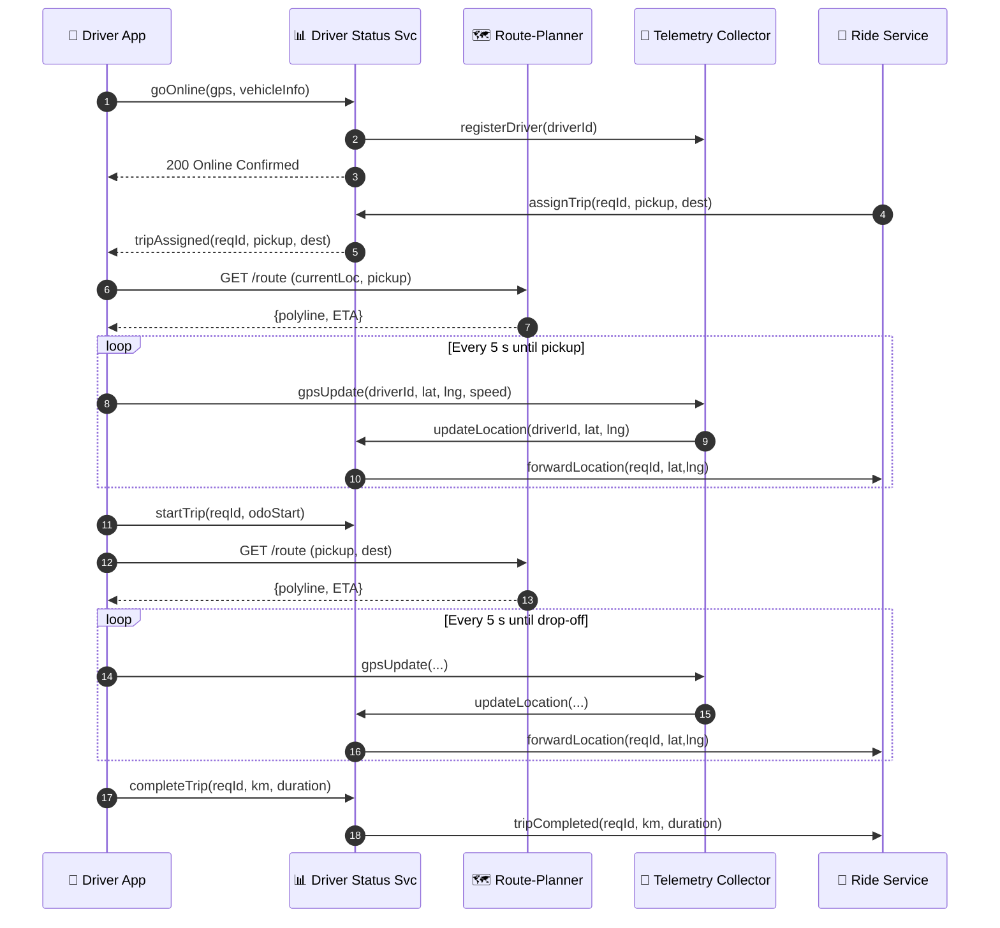

# Driver Dispatch & Navigation – Sequence Diagram

This component‑level sequence focuses on how the **Driver App** interacts with the **Driver Status Service**, **Route‑Planner**, and **Telemetry Collector** from the moment the driver goes online through live navigation.

---

### Component Responsibilities

| Component | Key Duties |
|-----------|------------|
| **Driver Status Service** | Availability, assignment updates, relays location to Ride Service |
| **Route‑Planner** | Optimal path & ETA using current GPS; re‑routes on detours |
| **Telemetry Collector** | Ingests high‑frequency GPS, speed, heading; stores raw telemetry for analytics |
| **Ride Service** | Orchestrates full trip lifecycle and passenger location updates |

Extend the loop for mid‑route rerouting, battery alerts, or sensor health checks as needed.
