# Driver Dispatch & Navigation – Sequence Diagram

This component‑level sequence focuses on how the **Driver App** interacts with the **Driver Status Service**, **Route‑Planner**, and **Telemetry Collector** from the moment the driver goes online through live navigation.

```mermaid
sequenceDiagram
    autonumber

    %% ===== Participants =====
    participant DApp  as 🚗 Driver App
    participant DStat as 📊 Driver Status Svc
    participant Route as 🗺️ Route‑Planner
    participant Tele  as 📡 Telemetry Collector
    participant Ride  as 🚕 Ride Service

    %% ------------------------------------------------------------
    %% 1. Driver Goes Online
    %% ------------------------------------------------------------
    DApp->>DStat: goOnline(gps, vehicleInfo)
    DStat->>Tele: registerDriver(driverId)
    DStat-->>DApp: 200 Online Confirmed

    %% ------------------------------------------------------------
    %% 2. Trip Assignment from Ride Service
    %% ------------------------------------------------------------
    Ride->>DStat: assignTrip(reqId, pickup, dest)
    DStat-->>DApp: tripAssigned(reqId, pickup, dest)

    %% ------------------------------------------------------------
    %% 3. Navigate to Pickup
    %% ------------------------------------------------------------
    DApp->>Route: GET /route (currentLoc, pickup)
    Route-->>DApp: {polyline, ETA}
    loop Every 5 s until pickup
        DApp->>Tele: gpsUpdate(driverId, lat, lng, speed)
        Tele->>DStat: updateLocation(driverId, lat, lng)
        DStat->>Ride: forwardLocation(reqId, lat,lng)
    end

    %% ------------------------------------------------------------
    %% 4. Trip In‑Progress
    %% ------------------------------------------------------------
    DApp->>DStat: startTrip(reqId, odoStart)
    DApp->>Route: GET /route (pickup, dest)
    Route-->>DApp: {polyline, ETA}
    loop Every 5 s until drop‑off
        DApp->>Tele: gpsUpdate(...)
        Tele->>DStat: updateLocation(...)
        DStat->>Ride: forwardLocation(reqId, lat,lng)
    end

    %% ------------------------------------------------------------
    %% 5. Trip Completed
    %% ------------------------------------------------------------
    DApp->>DStat: completeTrip(reqId, km, duration)
    DStat->>Ride: tripCompleted(reqId, km, duration)
```

---

### Component Responsibilities

| Component | Key Duties |
|-----------|------------|
| **Driver Status Service** | Availability, assignment updates, relays location to Ride Service |
| **Route‑Planner** | Optimal path & ETA using current GPS; re‑routes on detours |
| **Telemetry Collector** | Ingests high‑frequency GPS, speed, heading; stores raw telemetry for analytics |
| **Ride Service** | Orchestrates full trip lifecycle and passenger location updates |

Extend the loop for mid‑route rerouting, battery alerts, or sensor health checks as needed.
