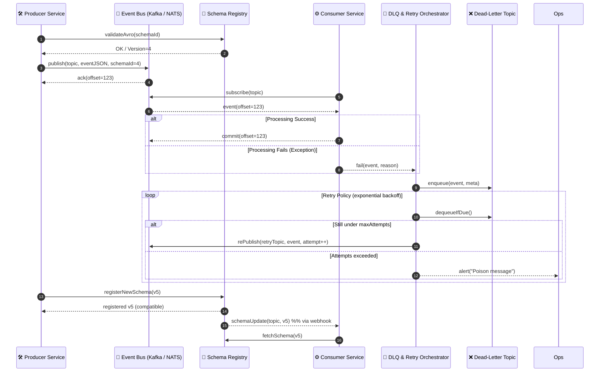

# Event Bus & Streaming – Sequence Diagram

Illustrates how a **Kafka / NATS cluster**, **Schema Registry**, and **DLQ & Retry Orchestrator** work together to ensure reliable event delivery.

---

### Component Responsibilities

| Component | Duty |
|-----------|------|
| **Event Bus (Kafka / NATS)** | Topic partitioning, ordering, at‑least‑once delivery |
| **Schema Registry** | Stores Avro/Protobuf schemas, compatibility checks, notifies consumers |
| **DLQ & Retry Orchestrator** | Handles failed messages, exponential back‑off, poison‑queue alerts |
