# Event Bus & Streaming – Sequence Diagram

Illustrates how a **Kafka / NATS cluster**, **Schema Registry**, and **DLQ & Retry Orchestrator** work together to ensure reliable event delivery.

```mermaid
sequenceDiagram
    autonumber

    %% ===== Participants =====
    participant Prod  as 🛠️ Producer Service
    participant Bus   as 📡 Event Bus (Kafka / NATS)
    participant Schema as 📑 Schema Registry
    participant Cons  as ⚙️ Consumer Service
    participant Retry as 🔄 DLQ & Retry Orchestrator
    participant DLQ   as ❌ Dead‑Letter Topic

    %% ------------------------------------------------------------
    %% 1. Publish Event
    %% ------------------------------------------------------------
    Prod->>Schema: validateAvro(schemaId)
    Schema-->>Prod: OK / Version=4
    Prod->>Bus: publish(topic, eventJSON, schemaId=4)
    Bus-->>Prod: ack(offset=123)

    %% ------------------------------------------------------------
    %% 2. Consume & Process
    %% ------------------------------------------------------------
    Cons->>Bus: subscribe(topic)
    Bus-->>Cons: event(offset=123)
    alt Processing Success
        Cons-->>Bus: commit(offset=123)
    else Processing Fails (Exception)
        Cons-->>Retry: fail(event, reason)
    end

    %% ------------------------------------------------------------
    %% 3. DLQ Handling
    %% ------------------------------------------------------------
    Retry->>DLQ: enqueue(event, meta)
    loop Retry Policy (exponential backoff)
        Retry->>DLQ: dequeueIfDue()
        alt Still under maxAttempts
            Retry->>Bus: rePublish(retryTopic, event, attempt++)
        else Attempts exceeded
            Retry-->>Ops: alert("Poison message")
        end
    end

    %% ------------------------------------------------------------
    %% 4. Schema Evolution (Async)
    %% ------------------------------------------------------------
    Prod->>Schema: registerNewSchema(v5)
    Schema-->>Prod: registered v5 (compatible)
    Schema-->>Cons: schemaUpdate(topic, v5)  %% via webhook
    Cons->>Schema: fetchSchema(v5)
```

---

### Component Responsibilities

| Component | Duty |
|-----------|------|
| **Event Bus (Kafka / NATS)** | Topic partitioning, ordering, at‑least‑once delivery |
| **Schema Registry** | Stores Avro/Protobuf schemas, compatibility checks, notifies consumers |
| **DLQ & Retry Orchestrator** | Handles failed messages, exponential back‑off, poison‑queue alerts |
