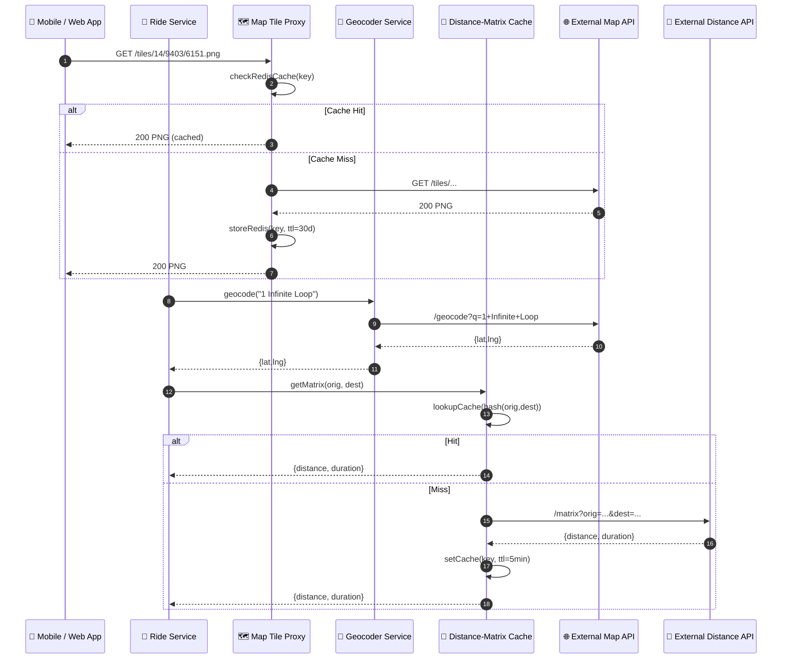

# Maps & Geolocation Services – Sequence Diagram

Shows how the **Map Tile Proxy**, **Geocoder**, and **Distance‑Matrix Cache** work together to serve mapping data efficiently.

---

### Component Responsibilities

| Component | Role |
|-----------|------|
| **Map Tile Proxy** | Caches vector/raster tiles, applies API keys & rate‑limit shielding |
| **Geocoder Service** | Securely proxies forward/reverse geocoding, normalises results |
| **Distance‑Matrix Cache** | Caches high‑traffic origin‑destination pairs for quick ETA calculations |
| **External Map / Distance APIs** | Third‑party providers (Google, Mapbox, OpenRoute, etc.) |

Add retry/back‑off, cache invalidation, or tile CDN routing as necessary.
