# Maps & Geolocation Services – Sequence Diagram

Shows how the **Map Tile Proxy**, **Geocoder**, and **Distance‑Matrix Cache** work together to serve mapping data efficiently.

```mermaid
sequenceDiagram
    autonumber

    %% ===== Participants =====
    participant App   as 📱 Mobile / Web App
    participant Ride  as 🚕 Ride Service
    participant Tile  as 🗺️ Map Tile Proxy
    participant Geo   as 📍 Geocoder Service
    participant DMC   as 📏 Distance‑Matrix Cache
    participant ExtMap as 🌐 External Map API
    participant ExtDist as 📡 External Distance API

    %% ------------------------------------------------------------
    %% 1. Map Tile Request (App render)
    %% ------------------------------------------------------------
    App->>Tile: GET /tiles/14/9403/6151.png
    Tile->>Tile: checkRedisCache(key)
    alt Cache Hit
        Tile-->>App: 200 PNG (cached)
    else Cache Miss
        Tile->>ExtMap: GET /tiles/...
        ExtMap-->>Tile: 200 PNG
        Tile->>Tile: storeRedis(key, ttl=30d)
        Tile-->>App: 200 PNG
    end

    %% ------------------------------------------------------------
    %% 2. Geocoding (Address → Lat/Lng)
    %% ------------------------------------------------------------
    Ride->>Geo: geocode("1 Infinite Loop")
    Geo->>ExtMap: /geocode?q=1+Infinite+Loop
    ExtMap-->>Geo: {lat,lng}
    Geo-->>Ride: {lat,lng}

    %% ------------------------------------------------------------
    %% 3. Distance Matrix (ETA / Surge)
    %% ------------------------------------------------------------
    Ride->>DMC: getMatrix(orig, dest)
    DMC->>DMC: lookupCache(hash(orig,dest))
    alt Hit
        DMC-->>Ride: {distance, duration}
    else Miss
        DMC->>ExtDist: /matrix?orig=...&dest=...
        ExtDist-->>DMC: {distance, duration}
        DMC->>DMC: setCache(key, ttl=5min)
        DMC-->>Ride: {distance, duration}
    end
```

---

### Component Responsibilities

| Component | Role |
|-----------|------|
| **Map Tile Proxy** | Caches vector/raster tiles, applies API keys & rate‑limit shielding |
| **Geocoder Service** | Securely proxies forward/reverse geocoding, normalises results |
| **Distance‑Matrix Cache** | Caches high‑traffic origin‑destination pairs for quick ETA calculations |
| **External Map / Distance APIs** | Third‑party providers (Google, Mapbox, OpenRoute, etc.) |

Add retry/back‑off, cache invalidation, or tile CDN routing as necessary.
