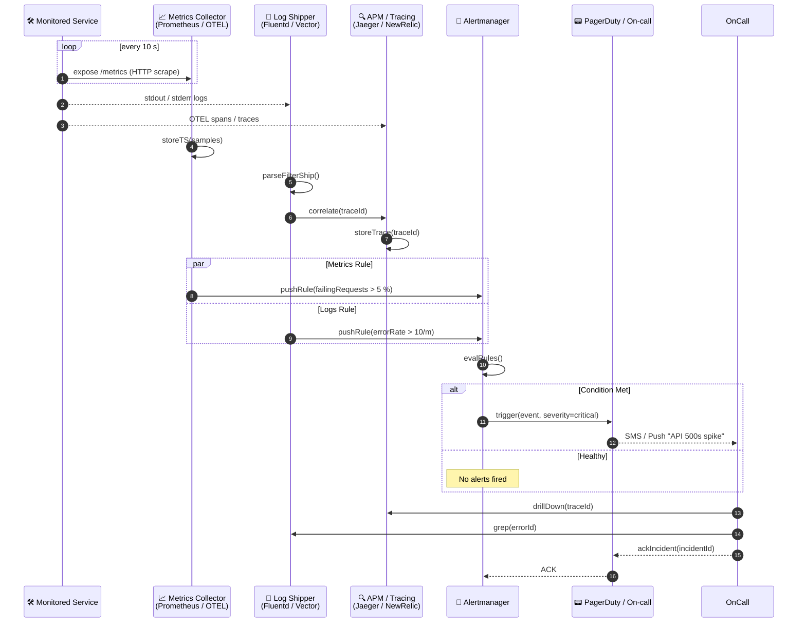

# Monitoring & Alerting – Sequence Diagram

This diagram shows how **Metrics Collector**, **Log Shipper**, **APM**, and **On‑call PagerDuty** collaborate for observability and incident response.

---

### Component Responsibilities

| Component | Role |
|-----------|------|
| **Metrics Collector** | Scrapes /metrics endpoints, stores time‑series, forwards alerts to Alertmanager |
| **Log Shipper** | Streams, parses, and enriches logs; ships to Elasticsearch/Loki |
| **APM** | Collects traces/spans, links logs & metrics via traceId |
| **Alertmanager** | Aggregates alert rules and silences; routes to PagerDuty |
| **PagerDuty** | Sends on‑call notifications, manages acknowledgement & escalations |

Add Grafana dashboards, SLO calculators, or auto‑scaling triggers as needed.
