# Monitoring & Alerting – Sequence Diagram

This diagram shows how **Metrics Collector**, **Log Shipper**, **APM**, and **On‑call PagerDuty** collaborate for observability and incident response.

```mermaid
sequenceDiagram
    autonumber

    %% ===== Participants =====
    participant App   as 🛠️ Monitored Service
    participant Metr  as 📈 Metrics Collector<br/>(Prometheus / OTEL)
    participant Logs  as 📑 Log Shipper<br/>(Fluentd / Vector)
    participant APM   as 🔍 APM / Tracing<br/>(Jaeger / NewRelic)
    participant Alert as 🚨 Alertmanager
    participant PDuty as 📟 PagerDuty / On‑call

    %% ------------------------------------------------------------
    %% 1. Runtime Telemetry Emission
    %% ------------------------------------------------------------
    loop every 10 s
        App->>Metr: expose /metrics (HTTP scrape)
    end
    App-->>Logs: stdout / stderr logs
    App-->>APM: OTEL spans / traces

    %% ------------------------------------------------------------
    %% 2. Ingestion & Storage
    %% ------------------------------------------------------------
    Metr->>Metr: storeTS(samples)
    Logs->>Logs: parseFilterShip()
    Logs->>APM: correlate(traceId)
    APM->>APM: storeTrace(traceId)

    %% ------------------------------------------------------------
    %% 3. Alert Evaluation
    %% ------------------------------------------------------------
    par Metrics Rule
        Metr->>Alert: pushRule(failingRequests > 5 %)
    and Logs Rule
        Logs->>Alert: pushRule(errorRate > 10/m)
    end
    Alert->>Alert: evalRules()
    alt Condition Met
        Alert->>PDuty: trigger(event, severity=critical)
        PDuty-->>OnCall: SMS / Push "API 500s spike"
    else Healthy
        Note over Alert: No alerts fired
    end

    %% ------------------------------------------------------------
    %% 4. Incident Workflow
    %% ------------------------------------------------------------
    OnCall->>APM: drillDown(traceId)
    OnCall->>Logs: grep(errorId)
    OnCall-->>PDuty: ackIncident(incidentId)
    PDuty-->>Alert: ACK
```

---

### Component Responsibilities

| Component | Role |
|-----------|------|
| **Metrics Collector** | Scrapes /metrics endpoints, stores time‑series, forwards alerts to Alertmanager |
| **Log Shipper** | Streams, parses, and enriches logs; ships to Elasticsearch/Loki |
| **APM** | Collects traces/spans, links logs & metrics via traceId |
| **Alertmanager** | Aggregates alert rules and silences; routes to PagerDuty |
| **PagerDuty** | Sends on‑call notifications, manages acknowledgement & escalations |

Add Grafana dashboards, SLO calculators, or auto‑scaling triggers as needed.
