# Notification Delivery – Sequence Diagram

Shows how the **Push Gateway**, **SMS/Email Adapters**, and **Templating Service** collaborate to deliver multi‑channel notifications.

```mermaid
sequenceDiagram
    autonumber

    %% ===== Participants =====
    participant Src   as 🛠️ Source Service (e.g. Ride, Payment)
    participant Temp  as 📝 Templating Service
    participant PushG as 📲 Push Gateway
    participant SMSA  as 📡 SMS Adapter
    participant EmailA as ✉️ Email Adapter
    participant APN   as 🔔 APNs / FCM
    participant SMSP  as 🛰️ SMS Provider
    participant SMTP  as 📧 SMTP Relay

    %% ------------------------------------------------------------
    %% 1. Source triggers notification
    %% ------------------------------------------------------------
    Src->>Temp: render(templateKey, data)
    Temp-->>Src: {title, body, channels}

    %% ------------------------------------------------------------
    %% 2. Fan‑out to chosen channels
    %% ------------------------------------------------------------
    par Push Notification
        Src->>PushG: send({title, body, token})
        PushG->>APN: pushRequest(token, payload)
        APN-->>PushG: 200 OK
        PushG-->>Src: delivered
    and SMS
        Src->>SMSA: send({body, phone})
        SMSA->>SMSP: smsRequest(phone, msg)
        SMSP-->>SMSA: msgId
        SMSA-->>Src: queued
    and Email
        Src->>EmailA: send({subject, body, email})
        EmailA->>SMTP: smtpSend(email, msg)
        SMTP-->>EmailA: 250 Accepted
        EmailA-->>Src: sent
    end

    %% ------------------------------------------------------------
    %% 3. Delivery Receipts (async)
    %% ------------------------------------------------------------
    APN-->>PushG: deliveryStatus(token, success)
    PushG-->>Src: statusUpdate(token, delivered)
    SMSP-->>SMSA: deliveryReceipt(msgId, delivered)
    SMSA-->>Src: statusUpdate(msgId, delivered)
```

---

### Component Roles

| Component | Responsibility |
|-----------|----------------|
| **Templating Service** | Renders localized titles/bodies using variables and A/B variants |
| **Push Gateway** | Abstracts APNs/FCM, handles retries & device token invalidation |
| **SMS / Email Adapters** | Transform payloads for provider APIs, track message IDs |
| **Source Service** | Business domain (Ride, Payment, Support) invoking notifications |

Add webhooks, in‑app inbox, or failover to SMS if push fails, as needed.
