# Payment, Pricing & Payouts – Sequence Diagram

Illustrates how **Fare Calculator**, **Promo/Discount Engine**, **Payment Gateway**, and **Driver Wallet** collaborate once a trip ends.

```mermaid
sequenceDiagram
    autonumber

    %% ===== Participants =====
    participant P        as 📱 Passenger App
    participant Ride     as 🚕 Ride Service
    participant FareCalc as 🧮 Fare Calculator
    participant Promo    as 🎟️ Promo / Discount Engine
    participant PayGW    as 💳 Payment Gateway
    participant Wallet   as 👛 Driver Wallet

    %% -----------------------------------------------------------------
    %% 0. Pre‑Trip (optional hold)
    %% -----------------------------------------------------------------
    P->>PayGW: addCard(token)
    Note over PayGW: Store vault token<br/>for later capture
    Ride->>PayGW: createAuthorization(token, estFare)
    PayGW-->>Ride: authId

    %% -----------------------------------------------------------------
    %% 1. Trip Completed
    %% -----------------------------------------------------------------
    Ride->>FareCalc: calcFare(km, duration, surge, promoCode?)
    FareCalc->>Promo: validatePromo(promoCode, userId, fareBase)
    alt Valid promo
        Promo-->>FareCalc: discount=€3
    else Invalid or expired
        Promo-->>FareCalc: discount=0
    end
    FareCalc-->>Ride: {fare, discount, surge}

    %% -----------------------------------------------------------------
    %% 2. Payment Capture
    %% -----------------------------------------------------------------
    Ride->>PayGW: capturePayment(authId, finalFare)
    alt Payment Success
        PayGW-->>Ride: paymentCaptured(txnId)
        PayGW->>Wallet: creditPayout(driverId, netFare)
        Wallet-->>PayGW: payoutQueued
        PayGW-->>P: receipt(txnId)
    else Payment Failure
        PayGW-->>Ride: captureFailed(reason)
        Ride-->>P: paymentError(reason)
        Ride->>PayGW: retryOrAlternate(token2)
    end

    %% -----------------------------------------------------------------
    %% 3. Driver Payout Settlement (batch)
    %% -----------------------------------------------------------------
    Note over Wallet: Nightly batch<br/>aggregates trips
    Wallet->>PayGW: initiateTransfer(driverId, totalDay)
    PayGW-->>Wallet: transferOK(bankTxnId)
```

---

### Key Responsibilities

| Component | Responsibilities |
|-----------|------------------|
| **Fare Calculator** | Base + time + distance + surge; produces itemised breakdown |
| **Promo / Discount Engine** | Validates codes, applies wallet credits, enforces usage limits |
| **Payment Gateway** | Stores card tokens, authorises pre‑trip hold, captures final amount, triggers payouts |
| **Driver Wallet** | Tracks driver earnings, batches payouts, exposes balance in driver app |

Need deeper error‑handling flows or partial‑capture scenarios? Just let me know!
