# Promotion & Campaign Manager – Sequence Diagram

Illustrates how the **Campaign Scheduler**, **Segmentation Engine**, and **Voucher Generator** coordinate to deliver targeted promotions.

```mermaid
sequenceDiagram
    autonumber

    %% ===== Participants =====
    participant Admin  as 🛠️ Marketing Portal
    participant Seg    as 👥 Segmentation Engine
    participant VGen   as 🎟️ Voucher Generator
    participant Sched  as 🕒 Campaign Scheduler
    participant Notif  as 🔔 Notification Service
    participant User   as 📱 Passenger App

    %% ------------------------------------------------------------
    %% 1. Campaign Creation
    %% ------------------------------------------------------------
    Admin->>Sched: createCampaign(id=SUMMER25, start=Jul10, end=Jul31, targetSeg=loyal, discount=25%)
    Sched-->>Admin: 201 Campaign Saved

    %% ------------------------------------------------------------
    %% 2. Pre‑Launch Audience Snapshot
    %% ------------------------------------------------------------
    Sched->>Seg: computeSegment("loyal")
    Seg-->>Sched: userList[10k]

    %% ------------------------------------------------------------
    %% 3. Voucher Batch Generation
    %% ------------------------------------------------------------
    Sched->>VGen: generateCodes(campaignId, 10k, pattern=SUM25-{rand})
    VGen-->>Sched: csvFile / codeIds

    %% ------------------------------------------------------------
    %% 4. Scheduled Blast (Jul 10 00:00)
    %% ------------------------------------------------------------
    par At start time
        Sched->>Notif: sendBulk(userList, template, codeIds)
        Notif-->>User: push "🎉 25 % off with code SUM25‑ABCD!"
    and Voucher activation
        Sched->>VGen: activateCodes(codeIds)
        VGen-->>Sched: OK
    end

    %% ------------------------------------------------------------
    %% 5. Voucher Redemption
    %% ------------------------------------------------------------
    User->>VGen: redeem(code="SUM25-ABCD", fare=€20)
    VGen->>VGen: validate(code, notExpired, user)
    alt Valid
        VGen-->>User: discount=€5
    else Invalid / Used
        VGen-->>User: 400 Code invalid
    end

    %% ------------------------------------------------------------
    %% 6. Campaign End & Report
    %% ------------------------------------------------------------
    Sched-->VGen: stats(used, unused)
    VGen-->>Sched: CSV metrics
    Sched-->>Admin: "Campaign ended – 35 % conversion"
```

---

### Component Responsibilities

| Component | Duty |
|-----------|------|
| **Campaign Scheduler** | Stores campaign meta, triggers sends, handles stop/start |
| **Segmentation Engine** | Dynamic queries on user traits (loyalty, region, spend) |
| **Voucher Generator** | Creates single‑use or multi‑use codes, tracks redemption |
| **Notification Service** | Push/SMS/email delivery with personalised code placeholders |
