# Rating & Feedback – Sequence Diagram

Captures how the **Rating Service**, **Sentiment Filter**, and **Reputation Scorer** collaborate when passengers and drivers leave feedback after a trip.

```mermaid
sequenceDiagram
    autonumber

    %% ===== Participants =====
    participant P   as 📱 Passenger App
    participant D   as 🚗 Driver App
    participant Rating as 📝 Rating Service
    participant Sent as 🧠 Sentiment Filter
    participant Rep  as ⭐ Reputation Scorer
    participant Supp as 🛠️ Support Desk (optional)

    %% ------------------------------------------------------------
    %% 1. Passenger Rates Driver
    %% ------------------------------------------------------------
    P->>Rating: POST /rate(driverId, 4★, "Great ride!")
    Rating->>Sent: analyse("Great ride!")
    Sent-->>Rating: {sentiment:+0.8, toxic:false}
    Rating->>Rating: storeRating()
    Rating->>Rep: updateDriverScore(driverId, 4★, sentiment)
    Rep-->>Rating: newAvg=4.73
    Rating-->>P: 200 "Thanks for your feedback!"

    %% ------------------------------------------------------------
    %% 2. Driver Rates Passenger
    %% ------------------------------------------------------------
    D->>Rating: POST /rate(riderId, 2★, "Rude customer")
    Rating->>Sent: analyse("Rude customer")
    Sent-->>Rating: {sentiment:-0.5, toxic:false}
    Rating->>Rep: updateRiderScore(riderId, 2★, sentiment)
    Rep-->>Rating: newAvg=4.12
    Rating-->>D: 200 "Thanks!"

    %% ------------------------------------------------------------
    %% 3. Toxic or Abusive Comment Flow
    %% ------------------------------------------------------------
    alt Comment flagged toxic
        P->>Rating: POST /rate(driverId, 1★, "Idiot!")
        Rating->>Sent: analyse("Idiot!")
        Sent-->>Rating: {sentiment:-0.9, toxic:true}
        Rating->>Supp: openTicket(tripId, comment)
        Rating->>Rep: updateDriverScore(driverId, 1★, sentiment, weight=0)  %% weight 0 if abusive
        Supp-->>Rating: ticketId
        Rating-->>P: 202 "Feedback received – under review"
    end
```

---

### Component Responsibilities

| Component | Role |
|-----------|------|
| **Rating Service** | API for submitting and retrieving ratings; orchestrates analysis & reputation updates |
| **Sentiment Filter** | Natural‑language classifier; returns polarity & toxicity flags |
| **Reputation Scorer** | Computes weighted rolling averages, detects low‑rating thresholds, triggers incentives or de‑activation reviews |
| **Support Desk** | Receives tickets for abusive or flagged comments |

Extend with driver incentive triggers, badge achievements, or feedback push‑notifications as desired.
