# Ride Request & Matching — Sequence Diagram

Focuses on **Ride Service**, **Matching Engine**, **Surge Calculator**, and **ETA/Maps Adapter** during the request → match workflow.

```mermaid
sequenceDiagram
    autonumber

    %% Participants
    participant P     as "📱 Passenger App"
    participant Ride  as "🚕 Ride Service"
    participant ETA   as "🗺️ ETA / Maps Adapter"
    participant Surge as "📈 Surge Calculator"
    participant Match as "🤖 Matching Engine"
    participant D     as "🚗 Driver App"

    %% 1. Passenger requests a ride
    P ->> Ride: requestRide(origin, dest, prefs)
    Ride ->> ETA: getETA(origin, dest)
    ETA -->> Ride: {distance, eta}

    %% 2. Calculate surge multiplier
    Ride ->> Surge: getMultiplier(origin, vehicleType)
    Surge -->> Ride: surge=1.6x

    %% 3. Send request to Matching Engine
    Ride ->> Match: queueRequest(reqId, {eta, distance, surge})
    Note over Match: Ranks drivers by proximity & score

    loop Notify candidate drivers
        Match ->> D: offerRide(reqId, fareEstimate)

        alt Driver accepts
            D -->> Match: accept(reqId)
            Match -->> Ride: driverAssigned(driverId)
            Ride -->> P: showDriver(ETAx, surcharge)
        else Decline / timeout
            Note over Match: Try next driver
        end
    end

    %% 4. No Driver Found (Fallback)
    alt No driver after max attempts
        Match -->> Ride: noDriverFound
        Ride -->> P: suggestRetryOrSchedule()
    end
```

---

### Highlights

| Component              | Function                                                                                 |
| ---------------------- | ---------------------------------------------------------------------------------------- |
| **Ride Service**       | Orchestrates trip request, calls ETA & Surge, hands off to Matching Engine               |
| **ETA / Maps Adapter** | Provides distance & ETA via Google, Mapbox, or in-house routing                          |
| **Surge Calculator**   | Computes dynamic fare multiplier based on supply–demand, events, and weather             |
| **Matching Engine**    | Real-time driver ranking, offer loop with acceptance/timeout retries, and fallback logic |

