# Support & Ticketing – Sequence Diagram

This flow illustrates how the **Ticket Service**, **Chatbot**, **Agent Console**, and **SLA Timer** collaborate from the moment a user requests help until the ticket is resolved (or escalated).

```mermaid
sequenceDiagram
    autonumber

    %% ===== Participants =====
    participant User   as 📱 Rider / Driver App
    participant Chat   as 🤖 Chatbot
    participant Ticket as 🎫 Ticket Service
    participant SLA    as ⏰ SLA Timer
    participant Agent  as 👩‍💼 Agent Console

    %% ------------------------------------------------------------
    %% 1. User Starts Chat Session
    %% ------------------------------------------------------------
    User->>Chat: "I left my phone in car"
    Chat->>Chat: NLP intent detect (lost item)
    alt Bot can self‑serve
        Chat-->>User: FAQ steps / auto‑resolution
    else Needs human agent
        Chat->>Ticket: createTicket(userId, summary, priority=Medium)
        Ticket->>SLA: startTimer(ticketId, priority)
        Ticket-->>Chat: ticketId
        Chat-->>User: "Ticket #1234 created. An agent will reply shortly."
    end

    %% ------------------------------------------------------------
    %% 2. Agent Console Notification
    %% ------------------------------------------------------------
    Ticket->>Agent: newTicket(ticketId, details)
    Agent->>Ticket: claim(ticketId)
    Ticket-->>Agent: assigned

    %% ------------------------------------------------------------
    %% 3. Agent Replies via Chat
    %% ------------------------------------------------------------
    Agent->>Chat: sendReply(ticketId, "Hi, I'm looking into this.")
    Chat-->>User: Agent reply

    %% ------------------------------------------------------------
    %% 4. SLA Monitoring
    %% ------------------------------------------------------------
    par SLA clock
        SLA-->Ticket: tick()
        alt Ticket open & no update within SLA
            SLA->>Ticket: slaBreach(ticketId)
            Ticket->>Agent: notifyBreach(ticketId)
            Chat-->>User: "We’re escalating your request, sorry for the delay."
        end
    and User correspondence
        User->>Chat: addMessage(ticketId, "Thanks!")
        Chat->>Ticket: appendComment
    end

    %% ------------------------------------------------------------
    %% 5. Resolution & Closure
    %% ------------------------------------------------------------
    Agent->>Ticket: resolve(ticketId, resolutionNotes)
    Ticket->>SLA: stopTimer(ticketId)
    Ticket->>Chat: updateStatus(ticketId, Closed)
    Chat-->>User: "Issue resolved. Please confirm."
    User->>Chat: "All good, thanks!"
    Chat->>Ticket: confirmClosure(ticketId)
```

---

### Component Roles

| Component | Responsibility |
|-----------|----------------|
| **Chatbot** | NLP intent detection, canned responses, escalates to Ticket Service |
| **Ticket Service** | Stores ticket status, assigns agents, persists conversation, interfaces with SLA Timer |
| **SLA Timer** | Runs background timers; emits `slaBreach` events when thresholds exceeded |
| **Agent Console** | Human agent UI; claims tickets, replies, resolves issues |

You can extend with multi‑tier escalation, CSAT surveys, or canned‑reply libraries as needed.
