# System Health & Self-Healing — Sequence Diagram

Illustrates runtime resilience mechanisms: **Circuit-Breaker**, **Auto-Scaler**, and **Chaos Injector** working together to maintain service health.

```mermaid
sequenceDiagram
    autonumber

    %% Participants
    participant Client  as 🌐 Client / Upstream
    participant CB      as 🛡️ Circuit-Breaker Proxy
    participant Service as 🛠️ Application Service
    participant Chaos   as ☠️ Chaos Injector
    participant Metric  as 📈 Metrics Collector
    participant AS      as 📤 Auto-Scaler (HPA / KEDA)

    %% 1. Normal Request Flow
    Client->>CB: HTTP request
    CB->>Service: forward request
    Service-->>CB: 200 OK
    CB->>Client: 200 OK

    %% 2. Inject Fault (Chaos Experiment)
    Chaos->>Service: kill pod (SIGKILL)
    Note over Service: Pod restarts / becomes unhealthy

    %% 3. Circuit-Breaker Reaction
    Client->>CB: HTTP request
    CB->>Service: forward request
    Service-->>CB: 5xx error
    CB->>CB: incrementFailureCount()
    alt threshold exceeded
        CB->>Client: 503 Service Unavailable (OPEN)
    else below threshold
        CB->>Client: 500 Error
    end

    %% 4. Metrics & Auto-Scaling
    loop every 30 s
        Service-->>Metric: scrape /metrics (latency, errors, CPU)
        Metric-->>AS: pushSample
        AS->>AS: evaluate(HPA policy)
        alt CPU > 70% or ErrorRate > 10%
            AS->>Service: scaleUp(+2 pods)
        else CPU < 30% for 5 min
            AS->>Service: scaleDown(-1 pod)
        end
    end

    %% 5. Circuit-Breaker Half-Open
    Note over CB: After cool-down T, CB enters HALF-OPEN
    Client->>CB: probe request
    alt probe success
        CB->>Service: forward probe
        Service-->>CB: 200 OK
        CB->>CB: resetFailures()
        Note over CB: state = CLOSED
        CB->>Client: 200 OK
    else probe fails
        CB->>Service: forward probe
        Service-->>CB: 5xx error
        CB->>Client: 503 Service Unavailable (OPEN)
        CB->>CB: restartTimer()
        Note over CB: state = OPEN
    end
```

---

### Component Responsibilities

| Component                 | Role                                                                      |
| ------------------------- | ------------------------------------------------------------------------- |
| **Circuit-Breaker Proxy** | Tracks failure counts; opens to shed load; half-open probes for recovery  |
| **Auto-Scaler**           | Observes CPU/error metrics; scales replicas up/down per policy            |
| **Chaos Injector**        | Periodically introduces failures (kill, network delay) to test resilience |
| **Metrics Collector**     | Scrapes Prometheus/OTel metrics feeding Auto-Scaler decisions             |

Extend with graceful degradation, read-only toggles, or automated rollback triggers as needed.
