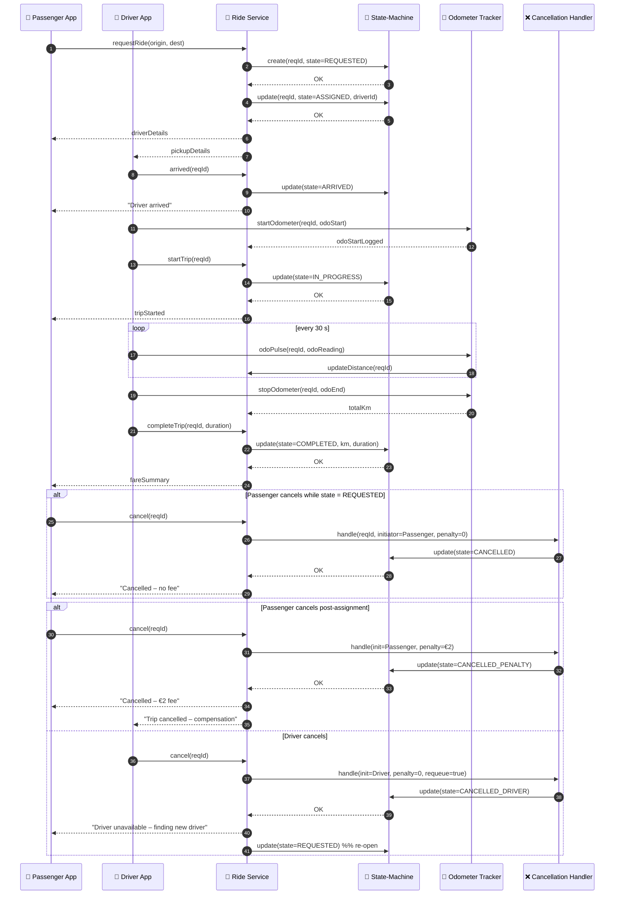

# Trip Lifecycle Management – Sequence Diagram

This sequence illustrates how the **State‑Machine**, **Odometer Tracker**, and **Cancellation Handler** orchestrate a ride’s lifecycle from request to completion—or cancellation.

---

### Key Concepts

| Component | Role |
|-----------|------|
| **State‑Machine** | Single source of truth for trip state; guards illegal transitions |
| **Odometer Tracker** | Records distance/time for fare calculation & compliance |
| **Cancellation Handler** | Applies business rules (fees, re‑queue, driver comp) and updates state atomically |

You can plug additional states (e.g., **NO_DRIVER**, **SCHEDULED**, **DISPUTED**) or timers (pickup timeout, driver wait fee) into this framework as needed.
