# Trip Lifecycle Management – Sequence Diagram

This sequence illustrates how the **State‑Machine**, **Odometer Tracker**, and **Cancellation Handler** orchestrate a ride’s lifecycle from request to completion—or cancellation.

```mermaid
sequenceDiagram
    autonumber

    %% ===== Participants =====
    participant P     as 📱 Passenger App
    participant D     as 🚗 Driver App
    participant Ride  as 🚕 Ride Service
    participant State as 🔄 State‑Machine
    participant Odo   as 📏 Odometer Tracker
    participant Canc  as ❌ Cancellation Handler

    %% ------------------------------------------------------------
    %% 0. Ride Requested
    %% ------------------------------------------------------------
    P->>Ride: requestRide(origin, dest)
    Ride->>State: create(reqId, state=REQUESTED)
    State-->>Ride: OK

    %% ------------------------------------------------------------
    %% 1. Driver Assigned
    %% ------------------------------------------------------------
    Ride->>State: update(reqId, state=ASSIGNED, driverId)
    State-->>Ride: OK
    Ride-->>P: driverDetails
    Ride-->>D: pickupDetails

    %% ------------------------------------------------------------
    %% 2. Driver Arrives at Pickup
    %% ------------------------------------------------------------
    D->>Ride: arrived(reqId)
    Ride->>State: update(state=ARRIVED)
    Ride-->>P: "Driver arrived"

    %% ------------------------------------------------------------
    %% 3. Start Trip
    %% ------------------------------------------------------------
    D->>Odo: startOdometer(reqId, odoStart)
    Odo-->>Ride: odoStartLogged
    D->>Ride: startTrip(reqId)
    Ride->>State: update(state=IN_PROGRESS)
    State-->>Ride: OK
    Ride-->>P: tripStarted

    %% ------------------------------------------------------------
    %% 4. Trip In‑Progress – Periodic Odometer / Location
    %% ------------------------------------------------------------
    loop every 30 s
        D->>Odo: odoPulse(reqId, odoReading)
        Odo->>Ride: updateDistance(reqId)
    end

    %% ------------------------------------------------------------
    %% 5. Trip Completed
    %% ------------------------------------------------------------
    D->>Odo: stopOdometer(reqId, odoEnd)
    Odo-->>Ride: totalKm
    D->>Ride: completeTrip(reqId, duration)
    Ride->>State: update(state=COMPLETED, km, duration)
    State-->>Ride: OK
    Ride-->>P: fareSummary

    %% ------------------------------------------------------------
    %% 6a. Cancellation BEFORE Driver Assigned
    %% ------------------------------------------------------------
    alt Passenger cancels while state = REQUESTED
        P->>Ride: cancel(reqId)
        Ride->>Canc: handle(reqId, initiator=Passenger, penalty=0)
        Canc->>State: update(state=CANCELLED)
        State-->>Ride: OK
        Ride-->>P: "Cancelled – no fee"
    end

    %% ------------------------------------------------------------
    %% 6b. Cancellation AFTER Driver Assigned but BEFORE Start
    %% ------------------------------------------------------------
    alt Passenger cancels post‑assignment
        P->>Ride: cancel(reqId)
        Ride->>Canc: handle(init=Passenger, penalty=€2)
        Canc->>State: update(state=CANCELLED_PENALTY)
        State-->>Ride: OK
        Ride-->>P: "Cancelled – €2 fee"
        Ride-->>D: "Trip cancelled – compensation"
    else Driver cancels
        D->>Ride: cancel(reqId)
        Ride->>Canc: handle(init=Driver, penalty=0, requeue=true)
        Canc->>State: update(state=CANCELLED_DRIVER)
        State-->>Ride: OK
        Ride-->>P: "Driver unavailable – finding new driver"
        Ride->>State: update(state=REQUESTED)  %% re-open
    end
```

---

### Key Concepts

| Component | Role |
|-----------|------|
| **State‑Machine** | Single source of truth for trip state; guards illegal transitions |
| **Odometer Tracker** | Records distance/time for fare calculation & compliance |
| **Cancellation Handler** | Applies business rules (fees, re‑queue, driver comp) and updates state atomically |

You can plug additional states (e.g., **NO_DRIVER**, **SCHEDULED**, **DISPUTED**) or timers (pickup timeout, driver wait fee) into this framework as needed.
