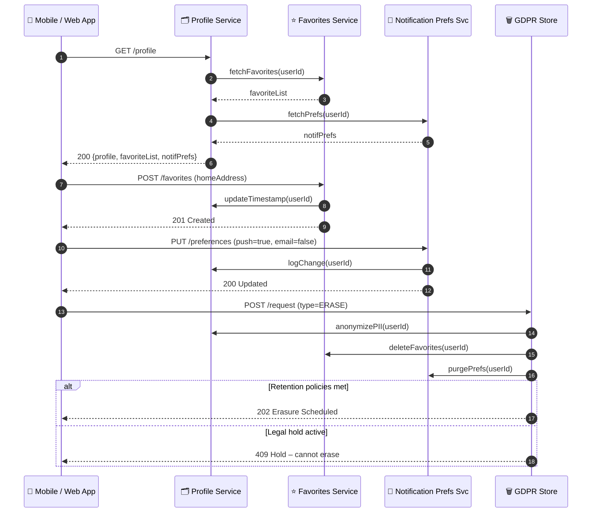

# User Profile & Preferences – Sequence Diagram

Covers core flows for **profile retrieval**, **favorites management**, **notification settings**, and **GDPR data handling**.

---

### Highlights

| Component | Responsibility |
|-----------|----------------|
| **Profile Service** | Core user record, last‑modified audit, preference pointers |
| **Favorites Service** | CRUD favourite locations / addresses |
| **Notification Settings Service** | Stores channel toggles, quiet hours, locales |
| **GDPR Store** | Orchestrates export, erasure, retention enforcement |

Extend this diagram with additional preferences (language, theme) or partial‑erase flows as needed. 
