# User Profile & Preferences – Sequence Diagram

Covers core flows for **profile retrieval**, **favorites management**, **notification settings**, and **GDPR data handling**.

```mermaid
sequenceDiagram
    autonumber

    %% ===== Participants =====
    participant App  as 📱 Mobile / Web App
    participant Prof as 🗂️ Profile Service
    participant Fav  as ⭐ Favorites Service
    participant Noti as 🔔 Notification Prefs Svc
    participant GDPR as 🗑️ GDPR Store

    %% ------------------------------------------------------------
    %% 1. Retrieve Profile & Preferences
    %% ------------------------------------------------------------
    App->>Prof: GET /profile
    Prof->>Fav: fetchFavorites(userId)
    Fav-->>Prof: favoriteList
    Prof->>Noti: fetchPrefs(userId)
    Noti-->>Prof: notifPrefs
    Prof-->>App: 200 {profile, favoriteList, notifPrefs}

    %% ------------------------------------------------------------
    %% 2. Add Favorite Location
    %% ------------------------------------------------------------
    App->>Fav: POST /favorites (homeAddress)
    Fav->>Prof: updateTimestamp(userId)
    Fav-->>App: 201 Created

    %% ------------------------------------------------------------
    %% 3. Update Notification Settings
    %% ------------------------------------------------------------
    App->>Noti: PUT /preferences (push=true, email=false)
    Noti->>Prof: logChange(userId)
    Noti-->>App: 200 Updated

    %% ------------------------------------------------------------
    %% 4. GDPR – Export or Erase
    %% ------------------------------------------------------------
    App->>GDPR: POST /request (type=ERASE)
    GDPR->>Prof: anonymizePII(userId)
    GDPR->>Fav: deleteFavorites(userId)
    GDPR->>Noti: purgePrefs(userId)
    alt Retention policies met
        GDPR-->>App: 202 Erasure Scheduled
    else Legal hold active
        GDPR-->>App: 409 Hold – cannot erase
    end
```

---

### Highlights

| Component | Responsibility |
|-----------|----------------|
| **Profile Service** | Core user record, last‑modified audit, preference pointers |
| **Favorites Service** | CRUD favourite locations / addresses |
| **Notification Settings Service** | Stores channel toggles, quiet hours, locales |
| **GDPR Store** | Orchestrates export, erasure, retention enforcement |

Extend this diagram with additional preferences (language, theme) or partial‑erase flows as needed. 
